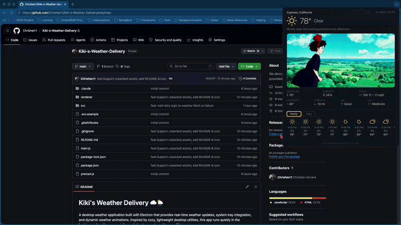

# Kiki's Weather Delivery ☁️🌦️

A desktop weather application built with Electron that provides real-time weather updates, system tray integration, and dynamic weather animations. Inspired by cozy, lightweight desktop utilities, this app runs quietly in the background and keeps you informed about current weather conditions.



---

## Tech Stack

* **Framework:** Electron
* **Language:** JavaScript (Node.js)
* **UI:** HTML, CSS, JavaScript (Renderer Process)
* **System Integration:** Electron Tray API, Notifications API
* **Weather API:** Pirate Weather

---

## Project Structure

```
.
├── dist/                     # Build output (ignored in development)
├── node_modules/            # Dependencies
├── package.json            # Project configuration
├── package-lock.json       # Dependency lock file
├── README.md               # Project documentation
├── main.js                 # Electron main process
├── preload.js              # Secure bridge between main and renderer
├── renderer/               # Frontend (UI + assets)
│   ├── index.html
│   ├── app.js
│   ├── *.gif               # Weather animations
│   ├── *.png / *.jpg       # Icons and images
│
└── src/                    # Core application logic
    ├── weather.js          # Weather API handling
    ├── tray.js             # System tray functionality
    └── notifications.js    # Desktop notifications
```

---

## Features

* 🌤️ Real-time weather updates (Pirate Weather API)
* 🖥️ Cross-platform: runs on **macOS and Windows**
* 📌 System tray integration
* 🔔 Weather-based notifications
* 🎞️ Animated weather visuals (GIF-based)
* 🌅 Dynamic visuals for different conditions (sunrise, rain, snow, etc.)

---

## Setup

### 1. Install dependencies

```bash
npm install
```

### 2. Configure environment variables

Copy the example environment file and add your API key:

```bash
cp .env.example .env
```

Then edit `.env` and add your Pirate Weather API key:

```env
PIRATE_WEATHER_API_KEY=your_api_key_here
```

### 3. Run the app

```bash
npm start
```

---

## Build

To package the app using **electron-builder**:

```bash
npm run build
```

If you do not have a build script configured, you can run it directly:

```bash
npx electron-builder
```

The packaged application files will be generated in the `dist/` folder (e.g., `.dmg` for macOS, Windows installers depending on your config).

---

## How It Works

* **Main Process (`main.js`)**

  * Creates the application window
  * Manages lifecycle events
  * Integrates tray and notifications

* **Preload (`preload.js`)**

  * Safely exposes APIs from Node to the renderer

* **Renderer (`renderer/`)**

  * Displays weather data
  * Handles UI updates and animations

* **Weather Module (`src/weather.js`)**

  * Fetches and processes weather data from Pirate Weather

* **Tray Module (`src/tray.js`)**

  * Adds app controls to the system tray

* **Notifications Module (`src/notifications.js`)**

  * Sends alerts based on weather conditions

---

## Assets

The app uses animated GIFs to represent different weather conditions:

* ☀️ Sunny
* 🌧️ Rain
* ❄️ Snow
* 🌩️ Thunderstorms
* 🌬️ Windy
* 🌅 Sunrise / Sunset

These are stored in the `renderer/` directory and dynamically displayed based on API responses.

---

## Future Improvements

* Add location search
* Add hourly and weekly forecasts
* Improve UI styling (React migration possible)
* Auto-launch on system startup
* Settings menu for notifications and units (°F / °C)

---

## Notes

* The `dist/` folder contains packaged builds and should not be edited manually
* Keep your API key secure and never commit `.env` to version control

---

## Inspiration

A cozy, minimal weather app inspired by simple desktop utilities and Studio Ghibli aesthetics 🌸

---

## Author

Built as a personal project to learn Electron and desktop application development.
